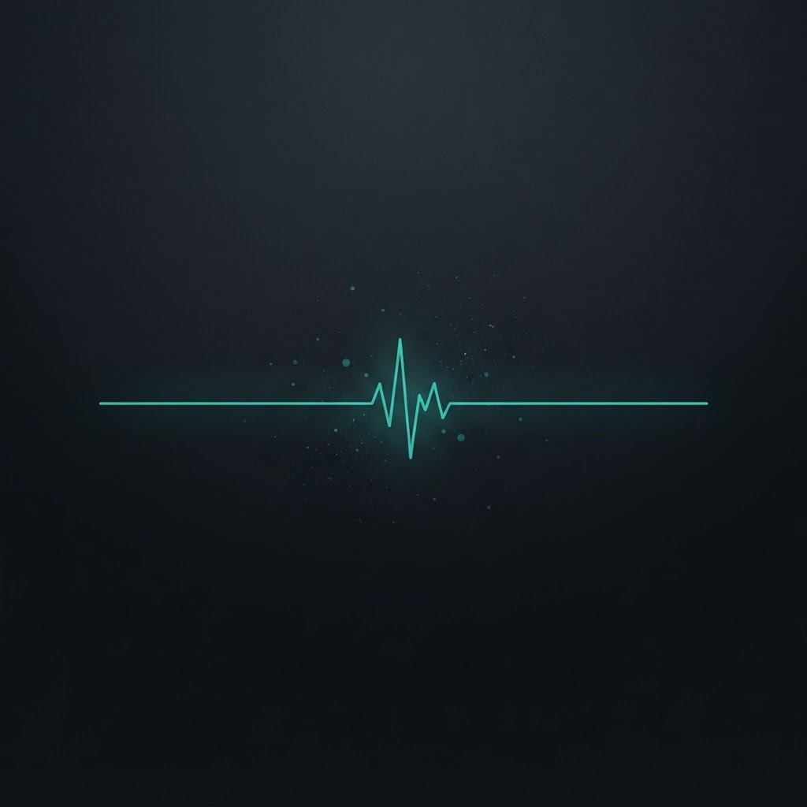

<!-- ============================================================= -->
<!--  morothox · profile readme                                    -->
<!-- ============================================================= -->

 

# morothox

  

## About

I'm a high school student who splits most of my time between a terminal and a race course.

Data is where I'm most at home — I like pulling messy datasets apart, cleaning and exploring them until they actually say something, then turning that into a chart or a model that holds up. Lately I'm going deeper into **machine learning**, working through the classical models and the math behind them before reaching for big frameworks.

The rest of my hours go to **triathlon** — swim, bike, run. Endurance sport and data taught me the same lesson: the numbers don't lie, and progress is just the sum of days you showed up. I also log my own training data and analyze it myself, which is honestly where a lot of my curiosity started.

On the technical side I stay close to the metal. I write **C** and **C++** because I want to understand what's happening beneath the abstractions, and I daily-drive **Arch Linux** for the same reason.

- Building small ML projects end to end — raw data → clean features → trained, evaluated model.
- Analyzing my own swim / bike / run telemetry.
- Reading more theory than tutorials, on purpose.

## Toolbox

**Languages**

**Data &amp; Machine Learning**

**Environment**

 
Daily driver: <strong>Arch Linux</strong> · editor: <strong>Vim</strong> · notebooks in <strong>Jupyter</strong>

## By the numbers

  

  

## Connect

&nbsp;

&nbsp;

  

<i>Swim. Bike. Run. Commit.</i>

